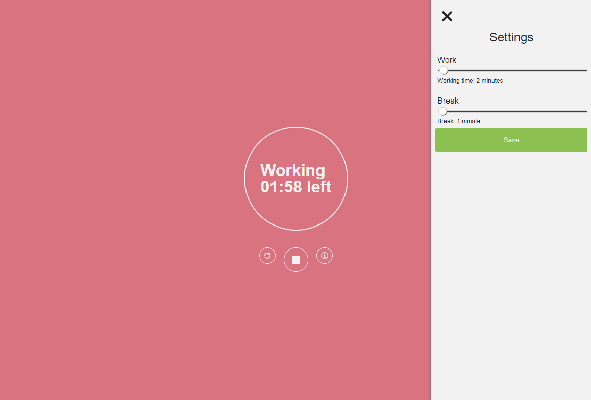

# Pomodoro Clock

A browser-based Pomodoro timer for work and break sessions.



## What it does

- Starts, stops, and resets work sessions.
- Alternates between work and break periods.
- Saves work and break durations in local storage.
- Plays a bell and shows browser notifications when a period ends.
- Runs as an installable PWA with a service worker.

## Stack

- React 19
- Redux Toolkit and React Redux
- TypeScript
- Parcel 2
- Primer Octicons
- Jest and React Testing Library

## Requirements

Use Node.js 24.14.1. The version is pinned in `.nvmrc`.

## Commands

Start the development server on port 8080:

```bash
npm start
```

Run the test suite:

```bash
npm test
```

Check TypeScript types:

```bash
npm run typecheck
```

Create a production build in `dist`:

```bash
npm run build
```

## Project layout

```text
src/
├── assets/       Styles, icons, and sounds
├── components/   Clock, controls, and settings UI
├── constants/    Shared values such as default durations
├── helpers/      Local storage and notification code
├── public/       HTML entry point, manifest, and service worker
├── store/        Redux Toolkit store and Pomodoro slice
├── types/        Shared TypeScript types
├── App.tsx
└── index.tsx
```

## Roadmap

- [ ] Profiles

## License

MIT
